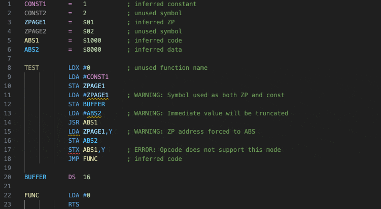
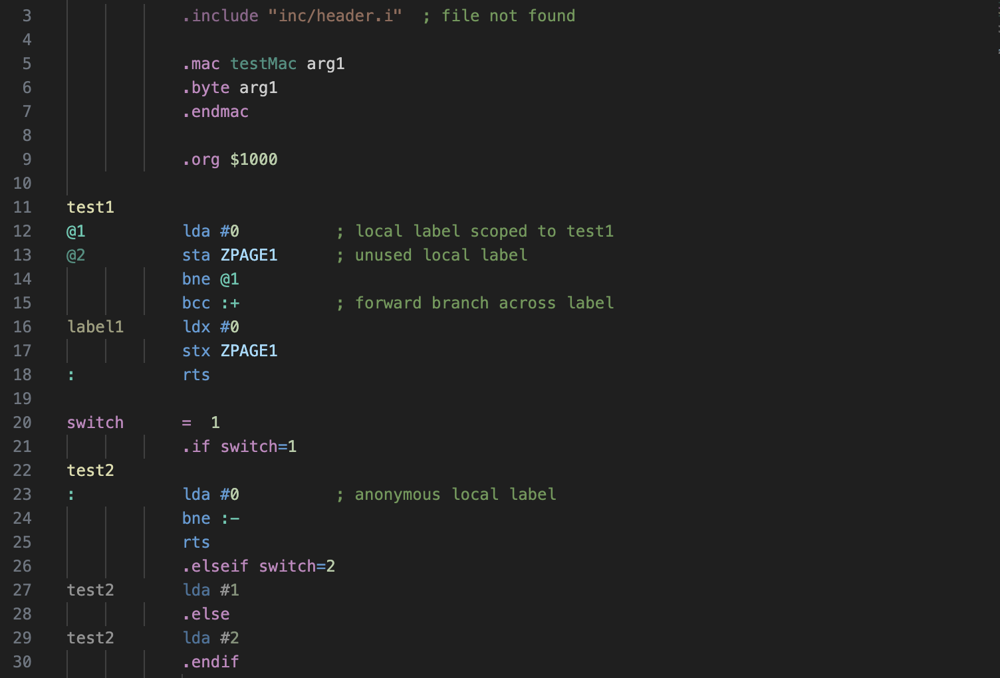

This Retro Programmer's Workshop (RPW) 65 extension provides Visual Studio Code support for 6502 assembly language in several syntaxes.  (See the RPW A2 extension for related functionality.)

Features include:
* 6502, 65C02, 65816, and 65EL02 assembly
* Merlin, dasm, ACME, ca65, 64tass, ORCA/M (APW), and LISA 2.5 syntaxes
* Semantic syntax highlighting
* Context specific auto-completion
* Symbol hover/tooltips
* Opcode and directive hover with descriptions, modes, etc.
* Variable tab stops with formatting
* Rename Symbol
* Renumber Locals
* Go To Definition
* Show References
* Code folding
* Diagnostic errors and warnings

Newest addition:
* Debug adapter connection to RPW A2 extension

Note that no external assembler executable is required for any syntax.

#### Syntax Highlighting and Diagnostics

#### Renumber Locals

#### Conditional Code

#### Symbol Hover

#### Variable Tab Stops

#### Merlin

#### DASM

#### CA65

### Projects

Project files can optionally be used to provide additional information about complex builds that can't easily be inferred from single source files.  They define the overall build structure, indicating the top-level assembly files for modules and how those modules are linked.  They can also list shared header files, making it possible to track symbol references across builds.

NOTE: Some functionality is disabled when when source files aren't part of a project.  (For example, highlighting of missing and unused symbols.)

#### example.rpw-project:

**srcDir** - Optional base path prepended to all other file paths and operations.

**includes** - Optional source files that are common across modules.  Specifying these files allows the extension to track symbol use across modules.

**modules** - Top-level source files for each assembled module, in the order that the modules will be assembled.  This tells the extension the start of each dependency tree so it can determine what files are used and what symbols are referenced.

### Known Problems
Variable tabbing command doesn't work correctly on files using tabs instead of spaces.

There are still gaps in syntax parsing that may incorrectly report errors, particularly for less frequently used options.  Error hiliting can be turned off by unchecking the "Hilite syntax errors" option in the RPW 65 settings.

### Request for Feedback

This is a work in progress, driven mostly by my own development needs.  If you install the extension and don't find it useful, I'd be interested in knowing what additions or changes would make it useful to you.  And of course, if you're using the extension and have suggestions for improvements, please report those as well.  Thanks!
