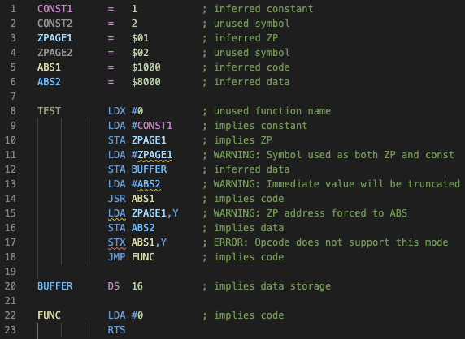
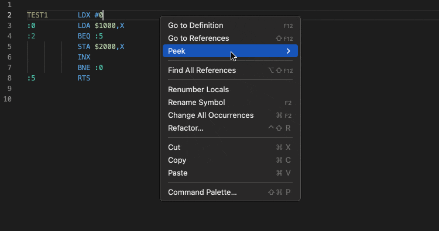
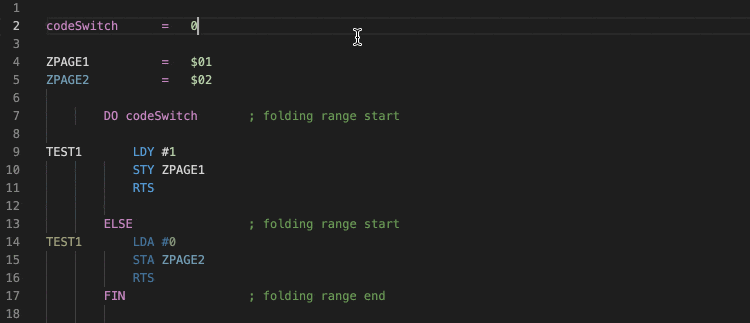
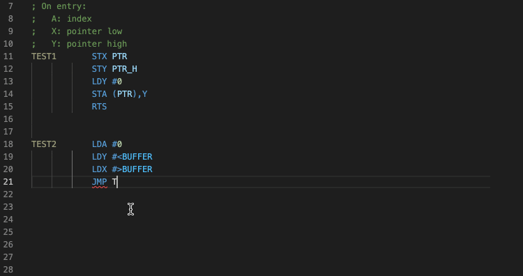
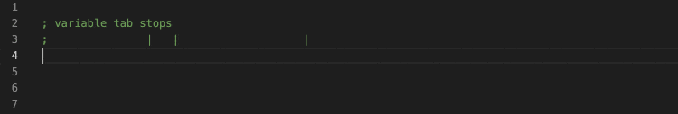
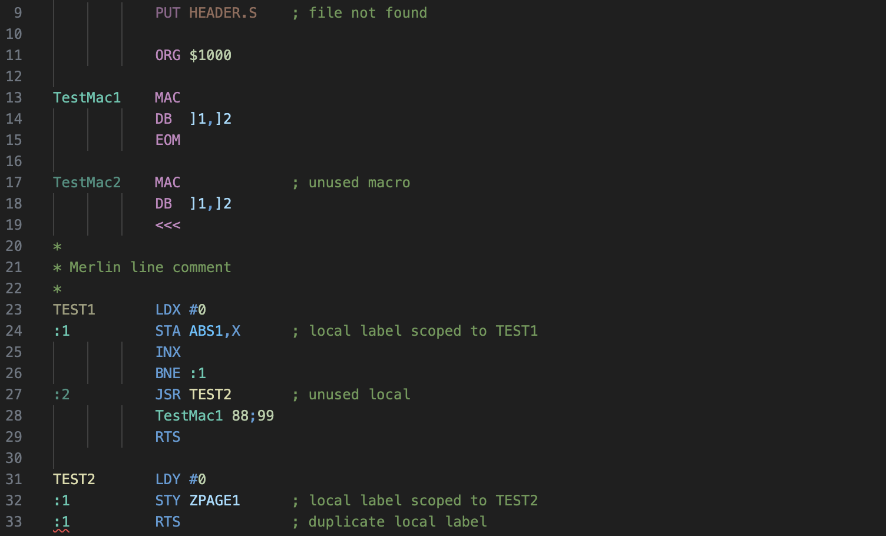
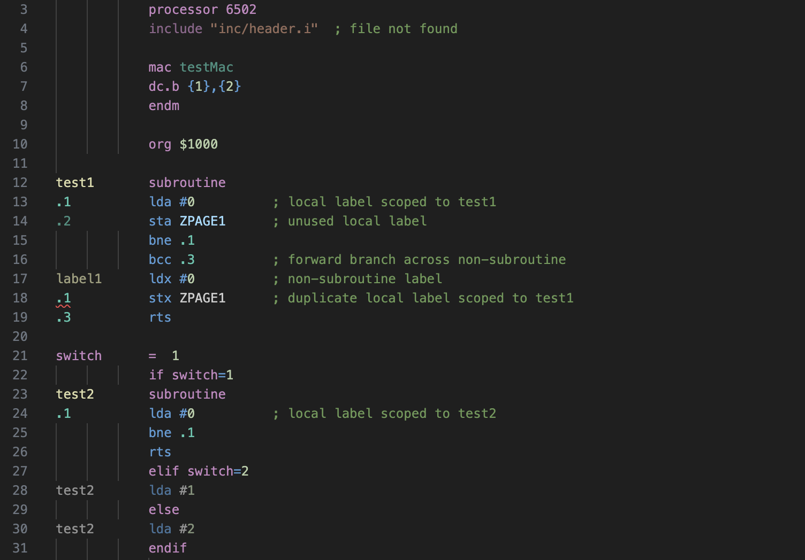
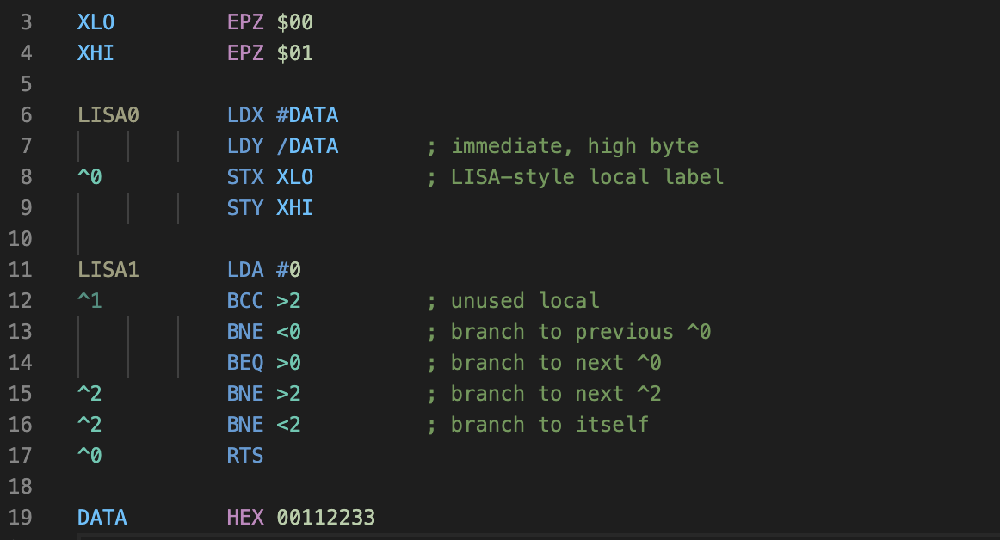
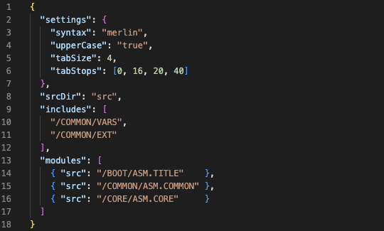

This Retro Programmer's Workshop (RPW) 65 extension provides Visual Studio Code support for 6502 assembly language in several common syntaxes.

Features include:
* Merlin, dasm, ACME, ca65, and LISA syntaxes
* Semantic syntax highlighting
* Context specific auto-completion
* Symbol hover/tooltips
* Variable tab stops with formatting
* Rename Symbol
* Renumber Locals
* Go To Definition
* Show References
* Conditional folding
* Diagnostic errors and warnings

Note that no external assembler executable is required for any syntax.

#### Syntax Highlighting and Diagnostics

#### Renumber Locals

#### Conditional Code

#### Symbol Hover

#### Variable Tab Stops

#### Merlin

#### DASM

#### LISA 2.5

### Projects

Project files can optionally be used to provide additional information about complex builds that can't easily be inferred from single source files.  They define the overall build structure, indicating the top-level assembly files for modules and how those modules are linked.  They can also list shared header files, making it possible to track symbol references across builds.

Note that some functionality is disabled when when source files aren't part of a project.  (For example, highlighting of missing and unused symbols.)

#### example.rpw-project:

**srcDir** - Optional base path prepended to all other file paths and operations.

**includes** - Optional source files that are common across modules.  Specifying these files allows the extension to track symbol use across modules.

**modules** - Top-level source files for each assembled module, in the order that the modules will be assembled.  This tells the extension the start of each dependency tree so it can determine what files are used and what symbols are referenced.

### Known Problems
* Variable tabbing command doesn't work correctly on files using tabs instead of spaces.

This is a work in progress.  Syntax parsing gaps are still being filled in.
